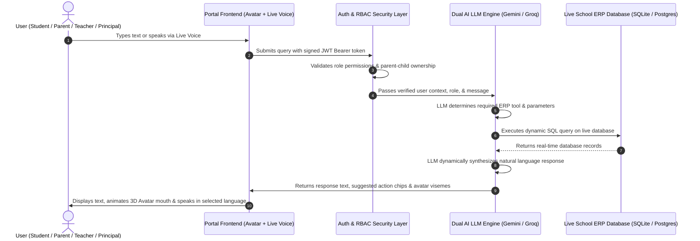

# XYZ AI — Human-Like AI School Assistant Ecosystem

**XYZ AI** is an enterprise-grade Applied AI ecosystem designed as an intuitive, empathetic, and human-like assistant for **Students, Parents, Teachers, and School Leadership/Principals** across **Interactive Chat, Continuous Live Duplex Voice, and 60FPS 3D Canvas AI Avatars**.

The platform is powered by a **Dual AI LLM Architecture (Google Gemini + Groq LLaMA)** with dynamic tool calling, strict **application-layer RBAC security**, **11 Indian regional languages & Hinglish**, a **3-state human escalation callback engine**, and **live database-backed ERP operations** (Attendance, Academics, Timetables, Fee Invoices, Circulars, Homework, and Leave Management).

---

## 🏗️ How the Application Works (End-to-End Flow)

XYZ AI does **not** rely on static hardcoded responses or pre-fitted mock text. Every query flows through an intelligent real-time pipeline:



### Detailed Pipeline Breakdown:
1. **User Authentication & Identity Verification**:
   - The user logs in with their credentials (e.g. email/password or demo switcher).
   - The backend signs a tamper-proof **JWT Bearer Token** containing verified `user_id`, `role`, and `name`.
2. **Zero-Trust RBAC & Ownership Guardrails**:
   - Before touching any data, [`05_xyz_ai/rbac.py`](file:///d:/Applied_AI/XYZ_AI/05_xyz_ai/rbac.py) checks if the user's role has permission to access the requested operation.
   - For parents, it strictly verifies child ownership so parents cannot access records for other families.
3. **Dual AI LLM Engine Execution (Gemini + Groq)**:
   - **Google Gemini 1.5 Flash / Pro** and **Groq LLaMA 3.3 70B** work in tandem with dynamic fallback.
   - The LLM dynamically analyzes the user's query, selects structured tools, triggers SQL database operations, retrieves live records, and formulates rich conversational responses.
4. **Live Database Extraction**:
   - Queries are executed directly against the live database (`students`, `attendance`, `grades`, `classes`, `fee_invoices`, `homework`, `escalation_tickets`).
5. **Multilingual Synthesis & 3D Canvas Avatar**:
   - The synthesized response is translated into the user's chosen language (Hindi, Gujarati, Tamil, Marathi, Hinglish, etc.) and spoken via Web Speech TTS while the 3D Canvas Avatar articulates real-time viseme mouth shapes.

---

## 🌟 Key Features & Capabilities

### 1. 📊 Comprehensive Attendance Operations Across All Roles
- 🎓 **Students**: View own cumulative attendance percentage, total present/absent days, and precise day-by-day logs (including distinguishing *yesterday* from *today*).
- 👨‍👩‍👧 **Parents**: View linked child's attendance rate, receive absence alerts, check day-by-day records, and submit leave notes directly.
- 👩‍🏫 **Teachers**: Hands-free voice or one-click attendance marking (e.g. *"Mark Rahul absent today"*), instant live database updates, and class roster summaries.
- 🏛️ **Principals**: Executive institution-wide attendance KPIs, class-by-class percentage breakdown, low attendance alerts, and individual student lookups.

### 2. 📞 Dissatisfaction Detection & "Request Callback" Escalation
When a user expresses dissatisfaction (*"I am not satisfied"*, *"I want to talk to the teacher"*, *"Connect me to management"*):
- The assistant immediately provides interactive options:
  - 📞 **"Request a Call Back / Talk to Teacher"**
  - 🏛️ **"Contact School Management"**
  - 🤖 **"Continue with AI"**
- Upon user confirmation, it generates a real **Escalation Ticket** in the database with a unique Ticket ID and assigns it to the teacher/leadership queue.
- **Anti-Hallucination Honesty Guarantee**: If a mock dispatch service fails, the bot truthfully informs the user rather than falsely claiming contact was made.

### 3. 🤖 4 Distinct AI Personas
| Persona | Role | Voice & Tone | Primary Responsibilities |
| :--- | :--- | :--- | :--- |
| **Alex** | **Student** | Friendly, motivating, cheerful | Homework assistance, exam schedules, Pomodoro study techniques, timetable lookup, exam stress relief. |
| **Maya** | **Parent** | Empathetic, patient, polite, clear | Child attendance tracking, report card marks, fee balance inquiries & online UPI payment, leave applications. |
| **Professor Orion** | **Teacher** | Professional, collegial, concise | Live voice attendance marking, class roster analysis, assignment submission audits. |
| **Athena** | **Principal** | Executive, strategic, analytical | School-wide attendance KPIs, fee collection audits, class benchmarks, escalation ticket review. |

### 4. 🗣️ Dynamic Multilingual Intelligence (11 Indian Languages + Hinglish)
XYZ AI features an adaptive multilingual engine with real-time speech and script recognition across **11 Indian languages + Hinglish**:

- **🌐 In-Chat Script Auto-Detection**: If a user switches languages mid-conversation (e.g. typing in Devanagari, Gujarati script, Tamil script, or romanized Hinglish), the AI automatically detects the script and dynamically aligns all subsequent answers, database summaries, and tool confirmations to that language.
- **🎛️ Portal Dropdown Language Locking**: Selecting a language from the portal's top dropdown immediately updates the AI's greeting, interface labels, prompt chips, and text-to-speech engine to the chosen dialect.
- **🎙️ Live Duplex Voice Language Adaptation**: During hands-free continuous voice calls, the Web Speech Recognition engine dynamically updates its locale (e.g., `hi-IN`, `gu-IN`, `ta-IN`, `te-IN`, `mr-IN`, `kn-IN`, `bn-IN`, `pa-IN`, `ml-IN`, `ur-PK`, `en-IN`), allowing users to speak naturally in their native tongue without restarting the call.
- **Supported Languages**:
  1. `English` (`en`)
  2. `Hinglish` (`hinglish` — conversational Indian English + Hindi)
  3. `Hindi` (`hi` — हिन्दी)
  4. `Gujarati` (`gu` — ગુજરાતી)
  5. `Tamil` (`ta` — தமிழ்)
  6. `Telugu` (`te` — తెలుగు)
  7. `Marathi` (`mr` — मराठी)
  8. `Bengali` (`bn` — বাংলা)
  9. `Punjabi` (`pa` — ਪੰਜਾਬੀ)
  10. `Kannada` (`kn` — ಕನ್ನಡ)
  11. `Malayalam` (`ml` — മലയാളം)
  12. `Urdu` (`ur` — اردو)

---

## 🗄️ Database & Pre-Seeded Academic Records

XYZ AI includes a realistic, production-grade **School ERP relational database schema** (SQLite with WAL mode and PostgreSQL/Supabase compatibility) pre-populated with real academic data:

- 👥 **Users & Profiles**: Students, Parents, Teachers, and School Leadership with secure auth links.
- 🏫 **Classes & Subjects**: Grades 9 to 12 across Secondary, Senior Secondary PCMB (Physics, Chemistry, Math, Biology, CS), and Commerce.
- 📅 **3-Month Active Attendance Calendar**: Full daily attendance records through August 20, 2026.
- 📝 **Examinations & Grades**: Monthly Unit Tests, Quarterly Exams, and Mid-Terms with subject-wise marks, max marks, and teacher remarks.
- 💳 **Fee Invoices & Receipts**: Term-wise tuition fees, transportation fees, payment statuses (`paid`, `partial`, `unpaid`, `overdue`), and online transaction receipts.
- 📚 **Homework & Timetables**: Daily subject assignments with submission tracking and weekly period schedules.
- 🎫 **Escalation Tickets & Leaves**: Live support ticket queue and parent leave requisitions.

---

## 🚀 Quickstart: Setup & Running Guide

### 1. Clone the Repository
```bash
git clone https://github.com/amitshivhare7879/XYZ_AI.git
cd XYZ_AI
```

### 2. Configure Environment Variables (`.env`)
Create a `.env` file in the root directory by copying from `.env.example`:
```bash
cp .env.example .env
```

Ensure your `.env` contains:
```env
# Server Configuration
PORT=7860
ENVIRONMENT=development
USE_LOCAL_SQLITE_FALLBACK=true

# Security Key
JWT_SECRET=super_secret_xyz_ai_jwt_key_2026

# Optional LLM API Keys (Enables Live Gemini & Groq LLMs)
GEMINI_API_KEY=your_gemini_api_key_here
GROQ_API_KEY=your_groq_api_key_here

# Optional PostgreSQL / Supabase URL (Uses local SQLite fallback if unset)
DATABASE_URL=
```
*(Note: If API keys are omitted, the built-in deterministic multi-agent fallback engine handles all queries, tools, and conversations seamlessly).*

### 3. Install Dependencies
```bash
# Install Python requirements
pip install -r 05_xyz_ai/requirements.txt
```

### 4. Initialize & Seed the ERP Database
```bash
# Seeds full academic records (Grades 9-12, Attendance, Exams, Fees, Timetables)
python -m shared.seed_data
```

### 5. Start the Application Server
```bash
# Launch FastAPI backend & all portal frontends (Primary Command)
uvicorn 05_xyz_ai.main:app --host 0.0.0.0 --port 8000 --reload
```
*And open **http://localhost:8000** in your browser to start.*

*Or alternatively using the Hugging Face Spaces entrypoint (Port 7860):*
```bash
python app.py
```
*Or launch all portals on separate micro-frontend ports (3000-3004, 8000):*
```bash
python start_all.py
```

### 6. Open in Browser
- 🔐 **Unified Login (Role Switcher)**: [http://localhost:8000/login](http://localhost:8000/login)
- 🎓 **Student Academic Portal**: [http://localhost:8000/student](http://localhost:8000/student)
- 👨‍👩‍👧 **Parent Support Portal**: [http://localhost:8000/parent](http://localhost:8000/parent)
- 👩‍🏫 **Teacher / Staff Portal**: [http://localhost:8000/staff](http://localhost:8000/staff)
- 🏛️ **Management / Principal Portal**: [http://localhost:8000/management](http://localhost:8000/management)
- 📚 **Swagger Interactive API Docs**: [http://localhost:8000/docs](http://localhost:8000/docs)

---

## 🔑 Pre-Configured Demo Accounts

| Role | Email | Password | Pre-Assigned Context |
| :--- | :--- | :--- | :--- |
| **Student** | `rahul.patel@student.school.edu` | `password123` | Rahul Patel (Grade 10-A, Roll #10A-01) |
| **Parent** | `amit.patel@gmail.com` | `password123` | Mr. Amit Patel (Father of Rahul Patel) |
| **Teacher** | `anjali.verma@school.edu` | `password123` | Mrs. Anjali Verma (Class Teacher, Grade 10-A) |
| **Principal** | `principal@school.edu` | `password123` | Dr. Rajesh Sharma (School Leadership / Principal) |

---

## 🧪 Automated Testing Suite (50 / 50 Passing)

Run the full automated test suite to verify security, database tools, multilingual translation, and escalation state machines:

```bash
# Run all tests
pytest tests/ -v
```

### Verified Test Breakdown:
- **12 ERP Tool Execution Tests**: Student, Parent, Teacher, and Principal database queries.
- **4 Human Escalation Tests**: 3-state escalation state machine, callback requests, and honest mock dispatch.
- **10 Human Persona & Empathy Tests**: Memory retention, in-conversation corrections, and exam stress relief.
- **12 Multilingual Intelligence Tests**: Indic translations across Hindi, Gujarati, Tamil, Marathi, Kannada, and Hinglish.
- **9 RBAC Security & Guardrail Tests**: Parent-child link isolation, unauthorized fee blocks, fake role claims, and prompt injection defense.
- **2 Student Exam & Subject Guidance Tests**: Timetables, exam schedules, and Pomodoro study technique advice.
- **1 Fee Conversation Flow Test**: Multi-turn invoice and payment history persistence.

---

## 📦 Project Submission ZIP Archive

To generate a clean submission ZIP file ready for distribution (automatically excluding cache, virtual environments, and `.git` files):

```bash
python make_submission_zip.py
```
This produces `XYZ_AI_Submission.zip` in the root directory.

---

## 📄 License
This project is built for the **XYZ AI Applied AI Competition & Deployment**. All rights reserved.
