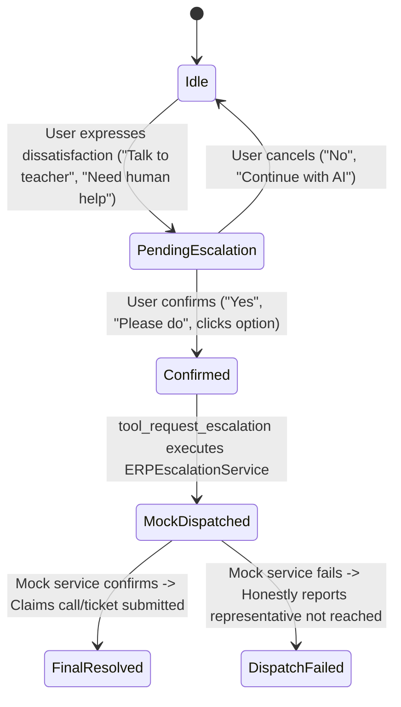

# XYZ AI — Human-Like AI School Assistant Ecosystem

**XYZ AI** is an Applied AI platform designed as an intuitive, human-like school assistant for **Students, Parents, Teachers, and School Leadership/Principals** across **Chat, Voice, and Interactive 3D AI Avatars**.

Built on a strict **monorepo architecture**, it enforces **deterministic application-layer RBAC security**, supports **11 Indian languages & Hinglish**, features a **3-state human escalation engine**, and encompasses **comprehensive School ERP operations** (Attendance, Academics, Timetables, Fee Invoices, Circulars, Homework, and Leave Management).

---

## 🌟 Key Highlights & Innovations

1. **4 Distinct AI Personas**: Role-adapted personality, tone, vocabulary, and capabilities tailored for each stakeholder.
2. **Interactive 3D AI Avatar & Viseme Lip-Sync**: Real-time canvas avatar that modulates mouth opening, width, and expressions during speech synthesis.
3. **Hands-Free Live Voice & Acoustic Echo Cancellation**: Continuous voice communication with intelligent speech recognition squelch and echo-loop elimination so the bot never listens to its own voice.
4. **Natural Human Conversational Intelligence**:
   - Time-of-day and name-aware personalized greetings.
   - Dynamic multi-turn context memory retention.
   - Correction handling (*"No, I meant Science"*, *"Actually for next Monday"*).
   - Clarification questioning (*"What dates and reason should I list for your leave note?"*).
   - Empathy for student exam anxiety and parent support.
5. **Real-Time Human Escalation State Machine**:
   - Interactive options: **“Talk to Teacher”** and **“Contact School Management”**.
   - Strict confirmation requirement before dispatching tickets.
   - Anti-hallucination honesty guarantee (never claims contact unless confirmed by the mock service).
6. **Robust Application-Layer RBAC Security**:
   - Zero trust: JWT tokens + entity ownership validation in code (not dependent on LLM goodwill).
   - Immune to prompt injections, role-claim impersonation, and unauthorized child/fee access.
7. **100% Automated Test Coverage**: 31 comprehensive pytest unit & integration tests passing with 100% success rate.

---

## 📁 Repository Structure

```text
XYZ_AI/
├── 01_student_portal/         # Student Portal Frontend (HTML5, Tailwind CSS, Canvas 3D Avatar, Web Speech)
│   ├── index.html             # Academic Assistant dashboard, live voice, homework, grades, timetable
│   └── package.json
├── 02_parent_portal/          # Parent Portal Frontend
│   ├── index.html             # Parent Support Assistant dashboard, child attendance, fees, report cards
│   └── package.json
├── 03_staff_portal/           # Teacher / Staff Portal Frontend
│   ├── index.html             # Teaching Assistant dashboard, voice/click attendance marking, rosters
│   └── package.json
├── 04_management_portal/      # Principal / Leadership Portal Frontend
│   ├── index.html             # Management Assistant dashboard, school KPIs, fee collection, escalations
│   └── package.json
├── 05_xyz_ai/                 # FastAPI Backend & Multi-Agent Orchestrator
│   ├── agent.py               # Human-like conversational orchestrator, memory & persona engine
│   ├── auth.py                # JWT authentication, demo login credentials & bearer verification
│   ├── erp_services.py        # Database-backed ERP business logic (Attendance, Fees, Grades, etc.)
│   ├── gemini_service.py      # Non-blocking Google Gemini API integration (with 5s timeout & fallback)
│   ├── groq_service.py        # Groq Llama API integration (with fast deterministic fallback)
│   ├── main.py                # FastAPI app, REST endpoints (/api/chat, /api/login), static mounts
│   ├── rbac.py                # Role-Based Access Control & parent-child ownership validator
│   ├── tools.py               # Safe ERP tool registry wrapping business services
│   ├── package.json
│   └── requirements.txt
├── shared/                    # Shared Schemas, Types & Database Core
│   ├── database.py            # Universal SQLite & PostgreSQL adapter (WAL mode, busy timeout)
│   ├── schemas.py             # Pydantic models for API requests, responses, and tokens
│   ├── seed_data.py           # Comprehensive Indian School ERP seed dataset (Grades 9-12 PCMB/Commerce)
│   └── types.ts               # TypeScript data definitions
├── tests/                     # Automated Test Suite (31 Tests)
│   ├── conftest.py            # Isolated database fixture setup
│   ├── test_erp_tools.py      # Student, Parent, Teacher, Principal ERP operations
│   ├── test_escalation.py     # 3-state escalation triggering, confirmation & mock dispatch
│   ├── test_human_assistant_personas.py # Personas, corrections, memory & clarification tests
│   └── test_rbac_security.py  # Prompt injection, fake role claims, and cross-parent access blocks
├── Dockerfile                 # Unified container deployment for Hugging Face Spaces / Cloud
├── .env.example               # Environment configuration template
└── README.md                  # Project Documentation
```

---

## 🎭 AI Personas & Behavioral Architecture

| Persona | Role | Voice & Tone | Primary Responsibilities |
| :--- | :--- | :--- | :--- |
| **Student** | **Academic Assistant** | Friendly, encouraging, cheerful, motivating | Homework assistance, exam schedules, study techniques (Pomodoro), timetable lookup, study stress relief. |
| **Parent** | **Parent Support Assistant** | Caring, patient, empathetic, polite, clear | Child attendance tracking, report card marks, fee balance inquiries & online payment, leave note submissions. |
| **Teacher** | **Teaching Assistant** | Professional, collegial, efficient, concise | Voice/one-click class attendance marking, student performance rosters, homework assignment publishing. |
| **Principal** | **Management Assistant** | Executive, strategic, analytical, data-driven | School-wide attendance KPIs, fee collection analytics, class breakdown benchmarks, escalation ticket review. |

---

## 📞 Human Escalation State Machine

When a user expresses dissatisfaction or requests direct staff interaction:



1. **Option Delivery**: Renders interactive suggested actions:
   - `Talk to Teacher`
   - `Contact School Management`
2. **Confirmation Prompting**:
   - Parent: *"I am not satisfied. I want to talk to my child's teacher."*
   - Assistant: *"Of course. I can connect you with the teacher. Would you like me to request a call now?"*
3. **Anti-Hallucination Honesty**:
   - If confirmed by mock service: *"Your call request has been submitted to the teacher."*
   - If dispatch fails: *"I was unable to dispatch the request to the mock service at this time. The teacher or school management has not been contacted."*

---

## 🛡️ Enterprise Security & RBAC Matrix

Security is enforced at the **application layer** in [`05_xyz_ai/rbac.py`](file:///d:/Applied_AI/XYZ_AI/05_xyz_ai/rbac.py), never delegated to prompt instructions:

| Capability / Resource | Student | Parent | Teacher | Principal |
| :--- | :---: | :---: | :---: | :---: |
| **View Own Attendance** | ✅ | ❌ | ❌ | ❌ |
| **View Linked Child's Attendance** | ❌ | ✅ *(Own Child Only)* | ❌ | ❌ |
| **Mark Class Attendance** | ❌ | ❌ | ✅ *(Assigned Class)* | ✅ |
| **School-Wide Analytics** | ❌ | ❌ | ❌ | ✅ |
| **View Report Cards / Marks** | ✅ *(Self)* | ✅ *(Own Child)* | ✅ *(Assigned Class)* | ✅ *(All)* |
| **Fee Invoices & Payments** | ❌ | ✅ *(Own Child)* | ❌ | ✅ *(Aggregates)* |
| **Submit Leave Applications** | ✅ | ✅ | ❌ | ❌ |
| **Create Escalation Tickets** | ✅ | ✅ | ✅ | ✅ |

- **Parent-Child Link Validation**: `validate_parent_student_ownership` ensures Parent A cannot inspect records for Parent B's child even if specifically requested by name or student ID.
- **Prompt Injection Defense**: Input guardrails detect and neutralize instructions attempting to override system rules, extract prompts, or elevate roles.

---

## 🗣️ Supported Languages & Multilingual Intelligence

XYZ AI dynamically processes conversations and outputs synthesized speech in **11 Indian languages + Hinglish**:

1. English (`en`)
2. Hinglish (`hinglish` — conversational Indian English + Hindi)
3. Hindi (`hi` — हिन्दी)
4. Gujarati (`gu` — ગુજરાતી)
5. Tamil (`ta` — தமிழ்)
6. Telugu (`te` — తెలుగు)
7. Marathi (`mr` — मराठी)
8. Bengali (`bn` — বাংলা)
9. Punjabi (`pa` — ਪੰਜਾਬੀ)
10. Kannada (`kn` — ಕನ್ನಡ)
11. Malayalam (`ml` — മലയാളം)
12. Urdu (`ur` — اردو)

---

## 🚀 Quickstart & Local Setup

### 1. Prerequisites
- Python 3.10+
- Modern Web Browser (Google Chrome or Microsoft Edge recommended for Web Speech & Web Audio APIs)

### 2. Environment Variables
Create a `.env` file in the root directory (or copy from `.env.example`):
```env
# Port & Environment
PORT=7860
ENVIRONMENT=development
USE_LOCAL_SQLITE_FALLBACK=true

# LLM Providers (Optional - built-in deterministic engine activates if unset)
GEMINI_API_KEY=your_gemini_api_key_here
GROQ_API_KEY=your_groq_api_key_here
JWT_SECRET=super_secret_xyz_ai_jwt_key_2026
```

### 3. Install Dependencies & Initialize Database
```bash
# Install Python packages
pip install -r 05_xyz_ai/requirements.txt

# Seed the real-world School ERP database
python -m shared.seed_data
```

### 4. Run the Platform
```bash
# Start the unified FastAPI backend & portal server
uvicorn 05_xyz_ai.main:app --host 0.0.0.0 --port 7860 --reload
```

### 5. Access the Portals
Once started, open your browser:
- 🎓 **Student Portal**: [http://localhost:7860/student](http://localhost:7860/student)
- 👨‍👩‍👧 **Parent Portal**: [http://localhost:7860/parent](http://localhost:7860/parent)
- 👩‍🏫 **Staff / Teacher Portal**: [http://localhost:7860/staff](http://localhost:7860/staff)
- 🏛️ **Management / Principal Portal**: [http://localhost:7860/management](http://localhost:7860/management)
- 📚 **API Documentation (Swagger UI)**: [http://localhost:7860/docs](http://localhost:7860/docs)

---

## 🧪 Automated Testing

The repository contains a full automated test suite validating security, ERP tools, personas, and escalation logic:

```bash
# Run all 40 tests across all domains
pytest -v

# Run specific domain test files
pytest tests/test_student_exam_and_subject_flow.py -v # Exam Schedules, Subject Guidance & Study Tips
pytest tests/test_fee_conversation_flow.py -v         # Multi-turn Context & Database History Persistence
pytest tests/test_multilingual_intelligence.py -v     # Hinglish, Hindi, Gujarati, Tamil, Marathi
pytest tests/test_human_assistant_personas.py -v      # AI Personas, Memory & Corrections
pytest tests/test_escalation.py -v                    # Escalation State Machine & Honesty
pytest tests/test_rbac_security.py -v                 # RBAC, Injection & Parent-Child Isolation
pytest tests/test_erp_tools.py -v                     # ERP Queries & Attendance Marking
```

### Test Suite Summary
```text
======================= 40 passed in 48.79s =======================
- 9 ERP Tool Capabilities Tests (Student, Parent, Teacher, Principal)
- 4 Escalation State Machine & Dispatch Verification Tests
- 10 AI Persona, Context Retention, Correction & Empathy Tests
- 2 Student Exam Schedule, Subject Guidance & Study Flow Tests
- 1 Multi-Turn Fee Conversation & Database History Persistence Test
- 6 Multilingual & Hinglish Intelligence Tests
- 8 RBAC Security, Prompt Injection & Access Isolation Tests
```

---

## 📄 License
This project is built for the **XYZ AI Applied AI Competition / Deployment**. All rights reserved.
